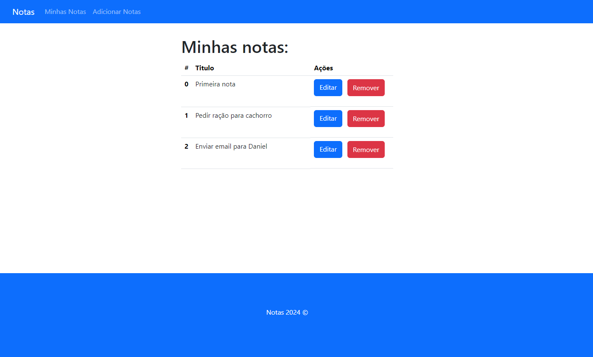

## Notas com Express, Node e MongoDB

O projeto Notas é uma aplicação web para o cadastro de notas. Cada nota contém um título e uma descrição do que deve ser feito. Além disso, é possível visualizar, alterar e excluir as notas.

<div align="center">
  
</div>

## 🚀 Tecnologias

- [NodeJS](https://nodejs.org/)
- [Express](https://expressjs.com/pt-br/)
- [Express-Handlebars](https://www.npmjs.com/package/express-handlebars)
- [Bootstrap](https://getbootstrap.com/)
- [BodyParser](https://www.npmjs.com/package/body-parser)
- [Dotenv](https://www.npmjs.com/package/dotenv)
- [MongoDB](https://www.mongodb.com/pt-br/atlas/database)
- [Nodemon](https://www.npmjs.com/package/nodemon)

##### Pré-requisitos

Antes de começar, certifique-se de ter o seguinte instalado em seu sistema:

Node.js (https://nodejs.org)

## ❓ Como utilizar

### Como instalar

1 - Faça o clone deste repositório para o seu ambiente local.

```bash
cd Notas_ExpressMongoDB
```

3 - Instale as dependências do projeto

```bash
npm install
```

4 - Altere o arquivo `.env-example` na raiz do projeto

5 - Para startar o servidor, digite:

```bash
npm start
```

### Uso

Após iniciar o servidor, você pode acessar a aplicação web no seu navegador através do endereço `http://localhost:8000`. A partir daí, você pode criar, visualizar, editar e excluir notas.

### Funcionalidades

As Notas possuem as seguintes funcionalidades:

🔹Visualizar todas as notas.</br>
🔹Cadastrar novas notas, fornecendo título e descrição.</br>
🔹Armazenar as notícias em uma collection no MongoDB.</br>
🔹Alterar notas utilizando o id da mesma.</br>
🔹Excluir notas utilizando o id.</br>
